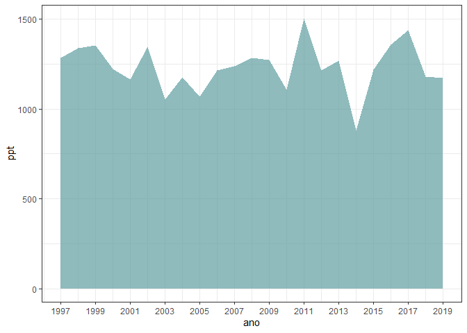

<!-- README.md is generated from README.Rmd. Please edit that file -->

# esalqmet

<!-- badges: start -->

 [](https://travis-ci.org/italocegatta/esalqmet)
[](https://ci.appveyor.com/project/italocegatta/esalqmet)
<!-- badges: end -->

The goal of esalqmet is to …

## Installation

You can install the released version of esalqmet from from
[GitHub](https://github.com/) with:

``` r
# install.packages("devtools")
devtools::install_github("italocegatta/esalqmet")
```

## Example

This is a basic example which shows you how to solve a common problem:

``` r

library(esalqmet)
library(tidyverse)
library(lubridate)

esalqmet_automatic %>% 
  group_by(ano = floor_date(data, "year")) %>% 
  summarise(ppt = sum(ppt, na.rm = TRUE)) %>%
  ggplot(aes(ano, ppt)) +
    geom_area(fill = "cadetblue", alpha = 0.7) +
    scale_x_date(date_breaks = "2 year", date_labels = "%Y") +
    theme_bw()
```


